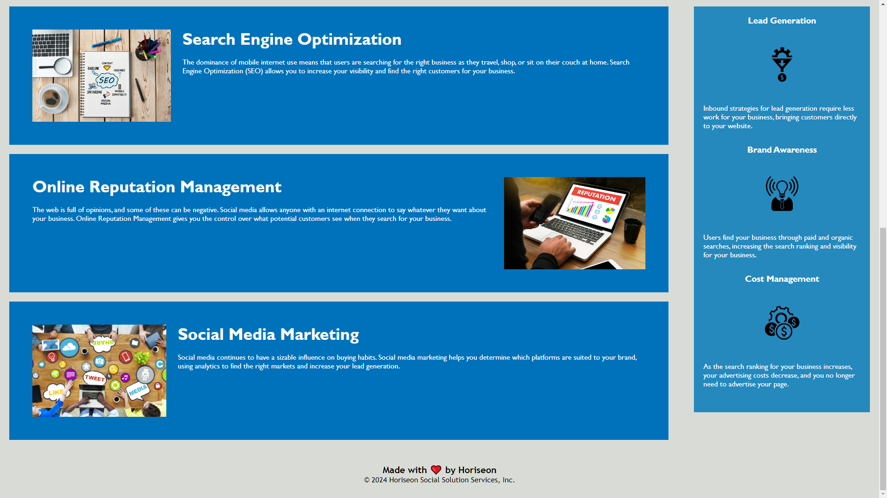

# first project/challenge (module-1-challenge-refactoring)

Zabir Sarwar, I am the one currently managing this pre-existing code and contact me for any advice or opinions you have for me
  - contact (GitHub): zzbrooks 

1. I'm currently working on refactoring existing code, HTML file, so that it is structured correctly and below is everything that I have refactored
  - added all necessary semantic HTML elements such as the sections, header, and footer
  - gave all images an alt attribute describing the image 
  - gave a detailed and concise title

2. I've learned and am still continuously learning the HTML semantics and learning how to manage an existing files so that the next person to look at that file can   understand the code better and make whatever changes necessary to bring the code up to "date"

3. Currently there are no known bugs but any fixes are greatly appreciated 

4. Only VSCode or (any other ide) and a browser are required to run the HTML file with the linked CSS file

5. Leave the folder labeled "readme-images", this was the only method I knew to how to render images to my readme and will have a fix for my future readme files

MOCKUP

